**GraphOptimization**
# Table of contents

- [reshape-py](#reshape-py)
  - [ReshapePatching](#reshapepatching)
  - [FuseReshape](#fusereshape)
- [activation-py](#activation-py)
- [batchdot-py](#batchdot-py)
- [argmax-py](#argmax-py)
- [batchedfc-py](#batchedfc-py)
- [broadcast-py](#broadcast-py)
- [broadcastmul-py](#broadcastmul-py)
- [concat-py](#concat-py)
    - [BatchedPermutation](#batchedpermutation)
    - [ConcatPatching](#concatpatching)
- [conv1x1-py](#conv1x1-py)
- [convolution-py](#convolution-py)
    - [ConvolutionPatching](#convolutionpatching)
    - [MoveReshapeFromConvBatchNorm](#movereshapefromconvbatchnorm)
- [crop-py](#crop-py)
- [deconvolution-py](#deconvolution-py)
- [detectionout-py](#detectionout-py)
- [dma-py](#dma-py)
- [dvtensor-py](#dvtensor-py)
- [eltwise-py](#eltwise-py)
    - [EltwisePatching](#eltwisepatching)
    - [EltwiseBroadcastPatching](#eltwisebroadcastpatching)
    - [ZeroAdd](#zeroadd)
    - [BroadcastEltwisePatching](#broadcasteltwisepatching)
    - [EltwiseConstantPatching](#eltwiseconstantpatching)
- [flatten-py](#flatten-py)
- [h_to_w-py](#h_to_w-py)
    - [Reduction](#reduction)
    - [L1Norm](#l1norm)
    - [LayerNorm](#layernorm)
    - [GroupNorm](#groupnorm)
    - [SoftMax](#softmax)
    - [BatchNorm](#batchnorm)
    - [HtoWforLayerNorm & HtoWforLayernNorm](#htowforlayernorm--htowforlayernnorm)
- [input-py](#input-py)
- [layer_fusion-py](#layer_fusion-py)
- [linear_upsample-py](#linear_upsample-py)
- [pad_fusion-py](#pad_fusion-py)
- [permute-py](#permute-py)
    - [FusePermute](#fusepermute)
    - [PermuteNNP](#permutennp)
    - [RemoveRedundantPermute](#removeredundantpermute)
    - [PermuteLarge](#permutelarge)
    - [PermuteToReshape](#permutetoreshape)
- [pooling-py](#pooling-py)
    - [ReductionPatching](#reductionpatching)
- [reduce-py](#reduce-py)
- [remove_no_op_layers-py](#remove_no_op_layers-py)
    - [AvgPool](#avgpool)
    - [Pool](#pool)
    - [Pad](#pad)
    - [Crop](#crop)
    - [Reshape](#reshape)
- [remove_redundant_layers-py](#remove_redundant_layers-py)
- [squash_consecutive_layer-py](#squash_consecutive_layer-py)
    - [Pads](#pads)
    - [Crops](#crops)
    - [Reshape](#reshape)
- [standardize_padding-py](#standardize_padding-py)
    - [Padding](#padding)
    - [KernelShape](#kernelshape)
    - [Strides](#strides)
- [swish-py](#swish-py)
- [upsample-py](#upsample-py)
- [Others](#others)
  - [aten-py](#aten-py)
  - [batchloop-py](#batchloop-py)
  - [cast-py](#cast-py)
  - [dynamic_input-py](#dynamic_input-py)
  - [group-py](#group-py)
  - [ibn_pattern_mather-py](#ibn_pattern_mather-py)
  - [identity-py](#identity-py)
  - [lut-py](#lut-py)
  - [reduce-py  - reduce len of name](#reduce-py----reduce-len-of-name)

# reshape-py

## ReshapePatching 
> Shuffle : True

If reshape is consumed by multiple successors, push reshape down. 

Example: 
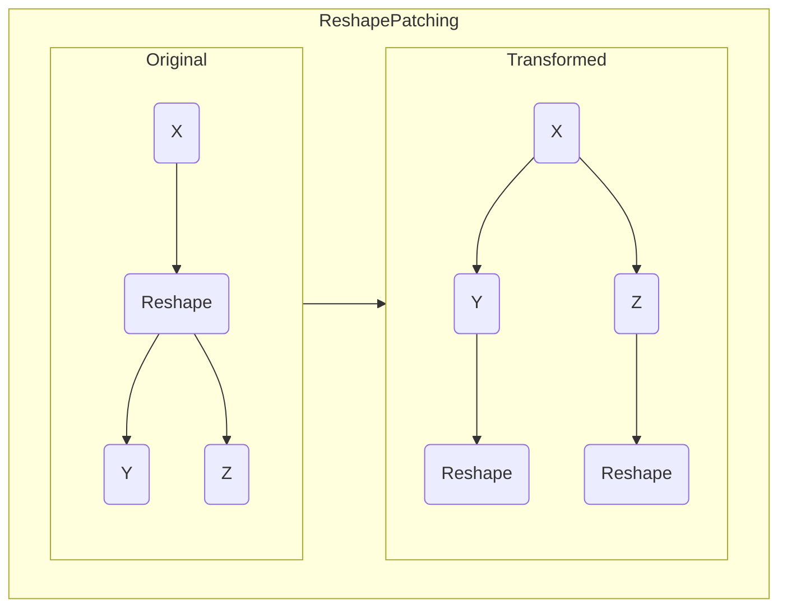
```mermaid
flowchart LR
  subgraph ReshapePatching
    direction LR
    subgraph Original
        f0(X) -->f1(Reshape)
        f1 --> f2(Y)
        f1 --> f3(Z)
    end
    subgraph Transformed
        f5(X) -->f6(Y)
        f5(X) -->f7(Z)
        f6 --> f8(Reshape)
        f7 --> f9(Reshape)
    end
  end
  Original --> Transformed
```
## FuseReshape
> Shuffle: False

Given consecutive reshape nodes, fuse them and preserve last reshape.
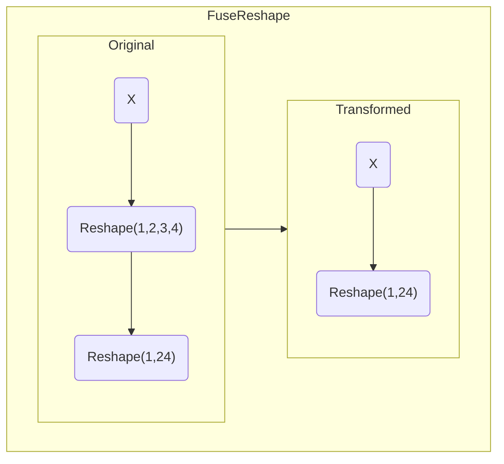
```mermaid
flowchart LR
  subgraph FuseReshape
    direction LR
    subgraph Original
        f0(X) -->f1("Reshape(1,2,3,4)")
        f1 --> f2("Reshape(1,24)")
    end
    subgraph Transformed
        f5(X) -->f6("Reshape(1,24)")
    end
  end
  Original --> Transformed
```
 
# activation-py
> Shuffle: True

Move activation up near conv or batchnorm if reshape or permute layers are in between.
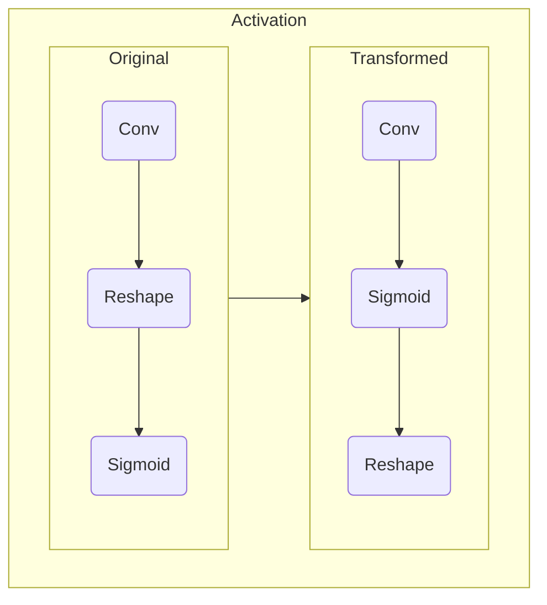
```mermaid
flowchart LR
  subgraph Activation
    direction LR
    subgraph Original
        f0(Conv) -->f1(Reshape)
        f1 --> f2(Sigmoid)
    end
    subgraph Transformed
        f3(Conv) -->f4(Sigmoid)
        f4 --> f5(Reshape)
    end
  end
  Original --> Transformed
```

# batchdot-py
> Shuffle: False

Make sure common dimension in matmul is last dimension for both inputs.
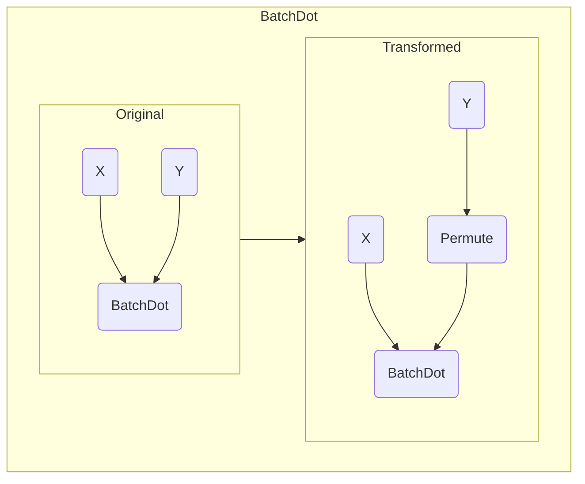
```mermaid
flowchart LR
  subgraph BatchDot
    direction LR
    subgraph Original
        f0(X) -->f1(BatchDot)
        f2(Y) --> f1
    end
    subgraph Transformed
        f3(X) -->f4(BatchDot)
        f5(Y) --> f6(Permute)
        f6 --> f4
    end
  end
  Original --> Transformed
```

# argmax-py
> Shuffle: False [changes outputLayer]

# batchedfc-py
> Shuffle: False

Convert FullyConnected with batch > 1 to Convolution 1x1
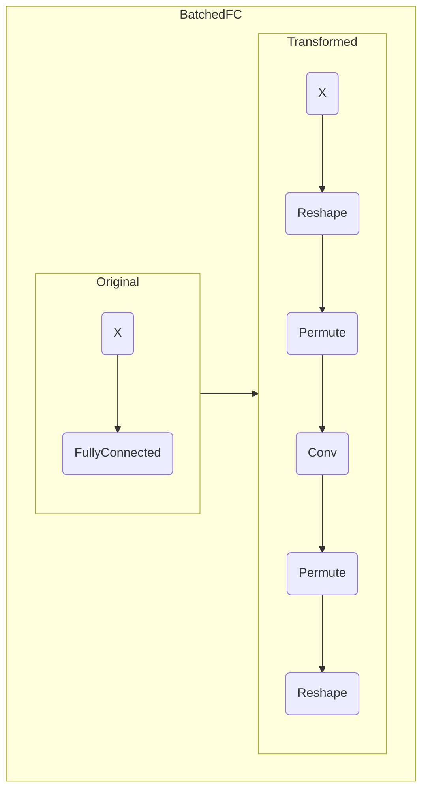
```mermaid
flowchart LR
  subgraph BatchedFC
    direction LR
    subgraph Original
        f0(X) -->f1(FullyConnected)
    end
    subgraph Transformed
        f2(X) -->f3(Reshape)
        f3 --> f4(Permute)
        f4 --> f5(Conv)
        f5 --> f6(Permute)
        f6 --> f7(Reshape)
    end
  end
  Original --> Transformed
```

# broadcast-py
> Shuffle: False

Broadcast individual inputs to eltwise depending on kernel availability

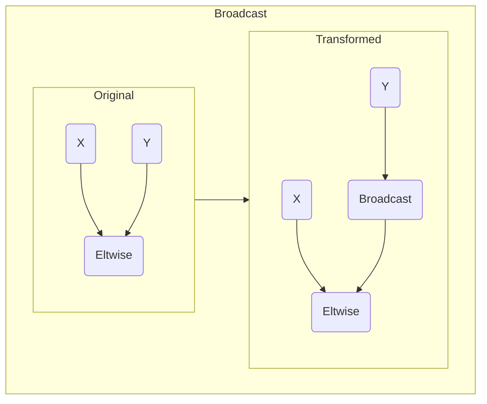
```mermaid
flowchart LR
  subgraph Broadcast
    direction LR
    subgraph Original
        f0(X) -->f1(Eltwise)
        f2(Y) --> f1
    end
    subgraph Transformed
        f3(X) -->f4(Eltwise)
        f5(Y) --> f6(Broadcast)
        f6 --> f4
    end
  end
  Original --> Transformed
```

# broadcastmul-py
> Shuffle: False

# concat-py
### BatchedPermutation 
> Shuffle: True
* only for onnx_batchpermutation

### ConcatPatching
> Shuffle: True

if parents are all [SoftMax / Sigmoid] push after concat.
if Conv -> concat -> Relu (strange logic) , push relu up. 

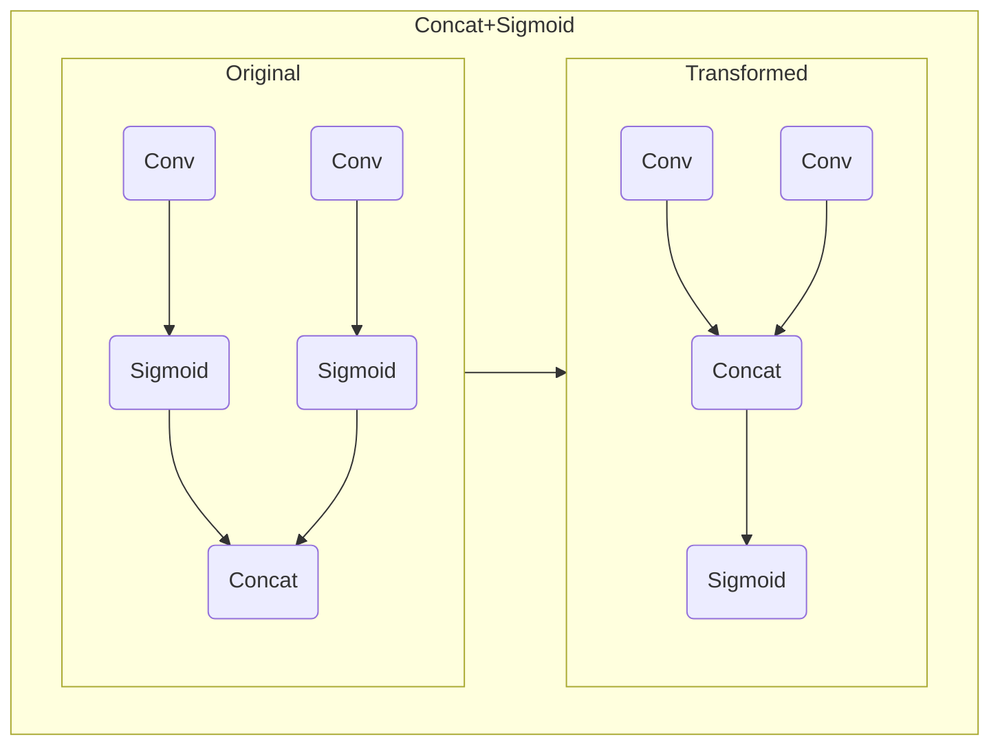
```mermaid
flowchart LR
  subgraph Concat+Sigmoid
    direction LR
    subgraph Original
        f0(Conv) --> f1(Sigmoid)
        f2(Conv) --> f3(Sigmoid)
        f1 --> f4(Concat)
        f3 --> f4
    end
    subgraph Transformed
        f5(Conv) --> f6(Concat)
        f7(Conv) --> f6
        f6 --> f8(Sigmoid)
    end
  end
  Original --> Transformed
```
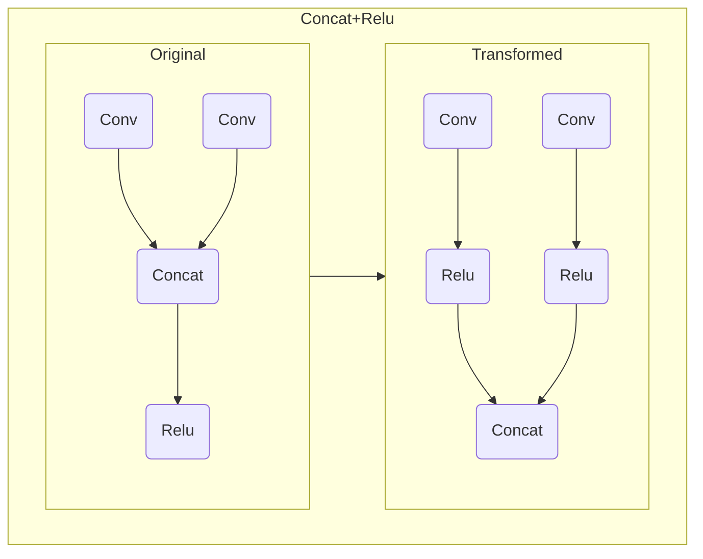
```mermaid
flowchart LR
  subgraph Concat+Relu
    direction LR
    subgraph Original
        f5(Conv) --> f6(Concat)
        f7(Conv) --> f6
        f6 --> f8(Relu)
    end
    subgraph Transformed
        f0(Conv) --> f1(Relu)
        f2(Conv) --> f3(Relu)
        f1 --> f4(Concat)
        f3 --> f4
    end
  end
  Original --> Transformed
```
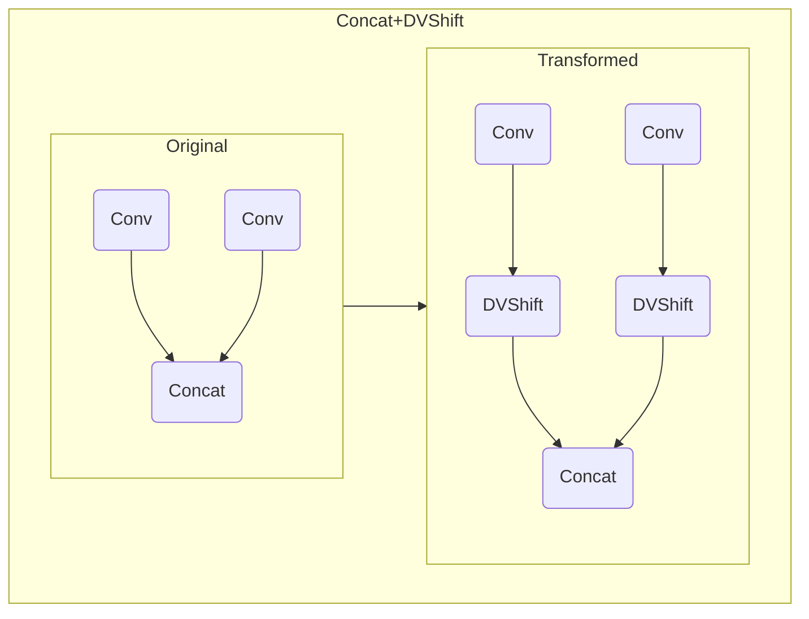
```mermaid
flowchart LR
  subgraph Concat+DVShift
    direction LR
    subgraph Original
        f5(Conv) --> f6(Concat)
        f7(Conv) --> f6
    end
    subgraph Transformed
        f0(Conv) --> f1(DVShift)
        f2(Conv) --> f3(DVShift)
        f1 --> f4(Concat)
        f3 --> f4
    end
  end
  Original --> Transformed
```

### ConcatAxis0To1Patching
> Shuffle: False

Shift axis from 0 to 1 since stack doesn't support concatenation on batch.
This transformation is not run for LSTM.

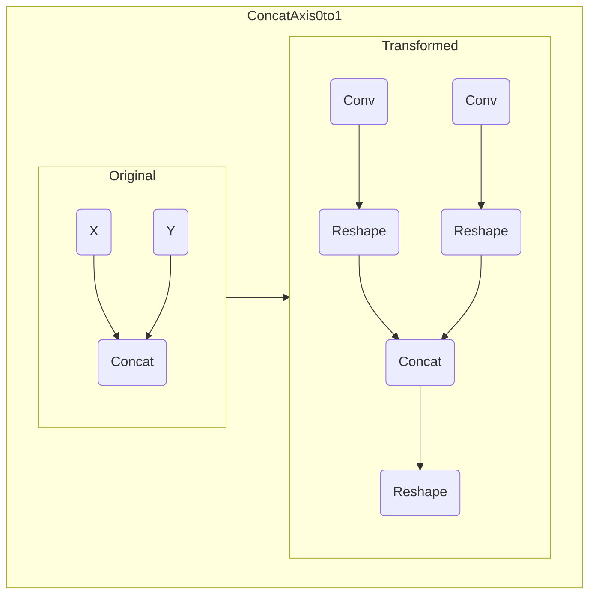
```mermaid
flowchart LR
  subgraph ConcatAxis0to1
    direction LR
    subgraph Original
        f5(X) --> f6(Concat)
        f7(Y) --> f6
    end
    subgraph Transformed
        f0(Conv) --> f1(Reshape)
        f2(Conv) --> f3(Reshape)
        f1 --> f4(Concat)
        f3 --> f4
        f4 --> f8(Reshape)
    end
  end
  Original --> Transformed
```

# conv1x1-py
> Shuffle: False

Move spatial dimension to width for better kernel performance.
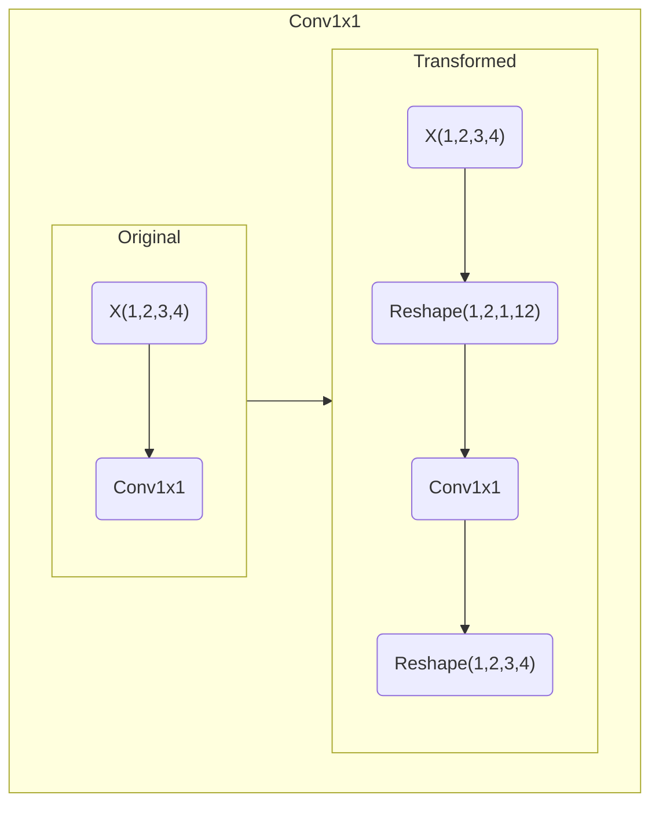
```mermaid
flowchart LR
  subgraph Conv1x1
    direction LR
    subgraph Original
        f0("X(1,2,3,4)") -->f1(Conv1x1)
    end
    subgraph Transformed
        f2("X(1,2,3,4)") -->f3("Reshape(1,2,1,12)")
        f3 --> f4(Conv1x1)
        f4 --> f5("Reshape(1,2,3,4)")
    end
  end
  Original --> Transformed
```

# convolution-py
### ConvolutionPatching 
> Shuffle: False

### MoveReshapeFromConvBatchNorm
> Shuffle: True

Move reshape/permute between conv and batchnorm to leverage fusion.
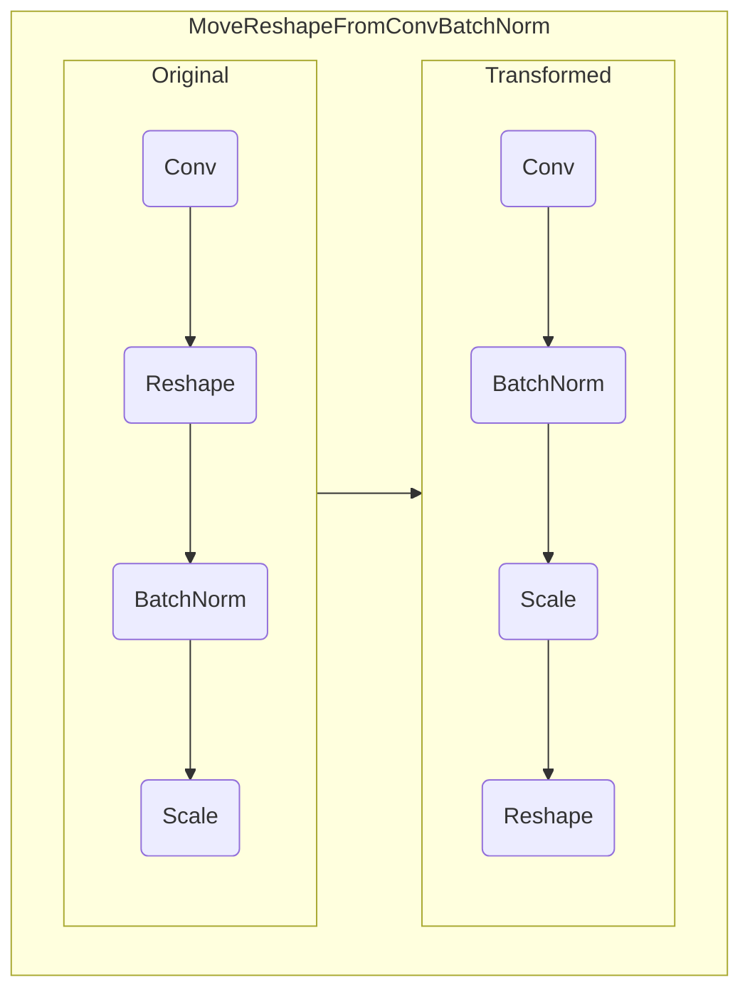
```mermaid
flowchart LR
  subgraph MoveReshapeFromConvBatchNorm
    direction LR
    subgraph Original
        f0(Conv) -->f1(Reshape)
        f1 --> f2(BatchNorm)
        f2 --> f3(Scale)
    end
    subgraph Transformed
        f4(Conv) --> f5(BatchNorm)
        f5 --> f6(Scale)
        f6 --> f7(Reshape)
    end
  end
  Original --> Transformed
```

# crop-py
> Shuffle: False

This was added to handle cases of large dma not fitting
into single decsriptor for efficientformerv2. Can be deprecated now. Splits large
size crops to multiple crops across axis.

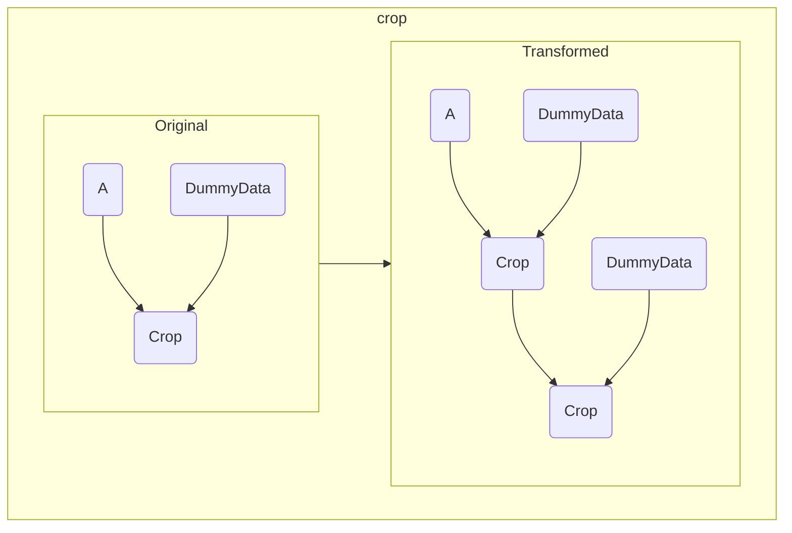
```mermaid
flowchart LR
  subgraph crop
    direction LR
    subgraph Original
        f0(A) -->f1(Crop)
        f2(DummyData) --> f1
    end
    subgraph Transformed
        f4(A) --> f5(Crop)
        f6(DummyData) --> f5
        f5 --> f7(Crop)
        f8(DummyData) --> f7
    end
  end
  Original --> Transformed
```

# deconvolution-py
> Shuffle: False

Since kernels are available for only specific dimensions, 
a 3x3 filter is padded to make it 4x4.
 
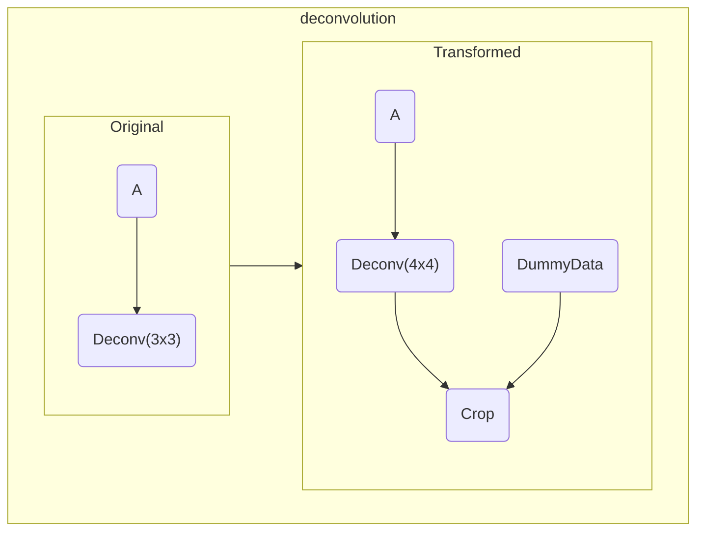
```mermaid
flowchart LR
  subgraph deconvolution
    direction LR
    subgraph Original
        f0(A) -->f1("Deconv(3x3)")
    end
    subgraph Transformed
        f2(A) --> f3("Deconv(4x4)")
        f3 --> f4(Crop)
        f5(DummyData) --> f4
    end
  end
  Original --> Transformed
```

# detectionout-py
> Shuffle: False

# dma-py
### BatchPatching
> Shuffle: False

It's specifially written for mxnet_take op if axis of take is batch,
it's shifted to other dimension.
 
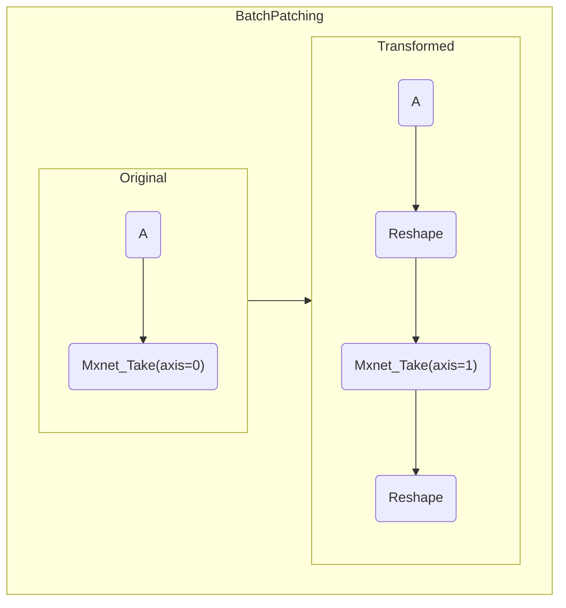
```mermaid
flowchart LR
  subgraph BatchPatching
    direction LR
    subgraph Original
        f0(A) -->f1("Mxnet_Take(axis=0)")
    end
    subgraph Transformed
        f2(A) --> f3(Reshape)
        f3 --> f4("Mxnet_Take(axis=1)")
        f4 --> f5(Reshape)
    end
  end
  Original --> Transformed
```

# dvtensor-py
### DVTensorPatching
> Shuffle: False

Convolution and InnerProduct input channels are padded to make them multiples of 4 and 32 respectively for kernels.

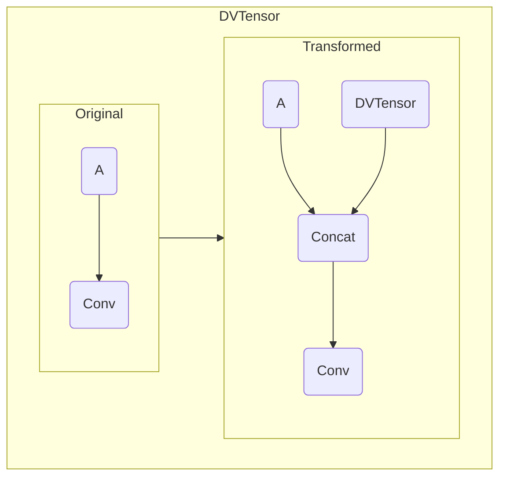
```mermaid
flowchart LR
  subgraph DVTensor
    direction LR
    subgraph Original
        f0(A) -->f1(Conv)
    end
    subgraph Transformed
        f2(A) --> f3(Concat)
        f3 --> f4(Conv)
        f5(DVTensor) --> f3
    end
  end
  Original --> Transformed
```

### DVTensorPermutePatching

If dvtensor is of weight type and there is a permute following it,
weights itself are permuted in dvtensor

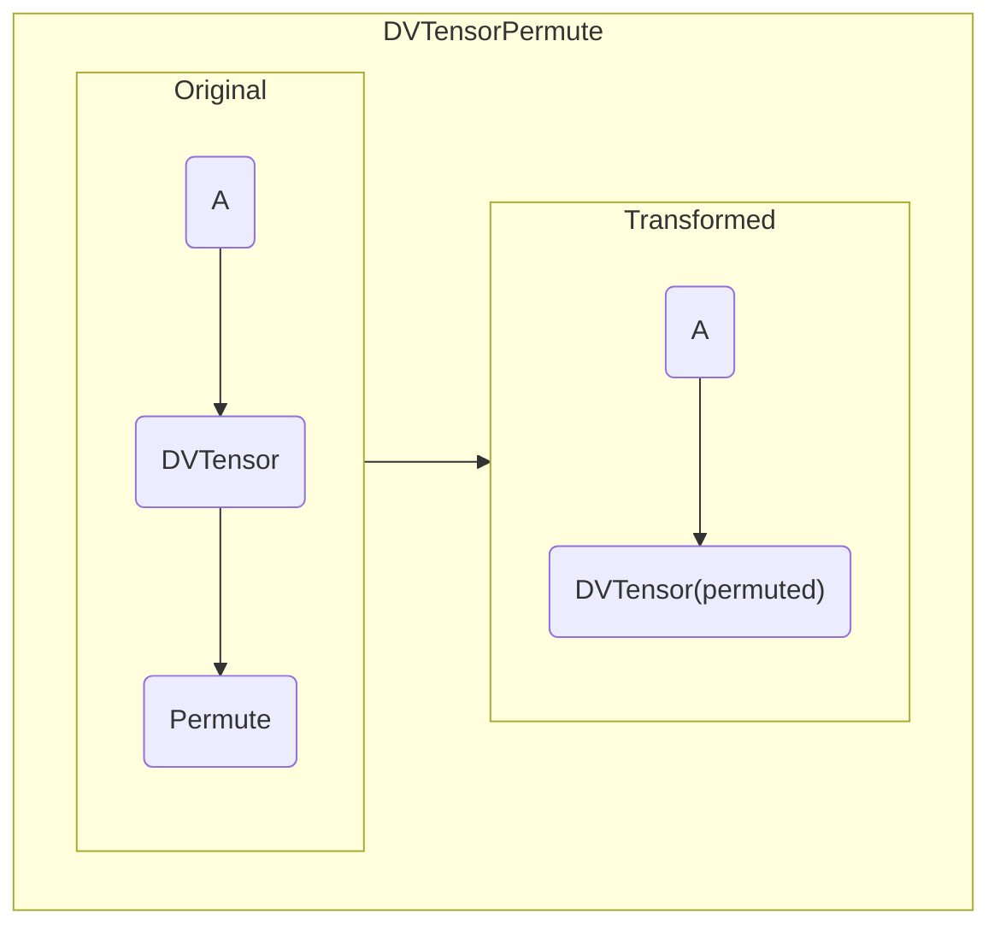
```mermaid
flowchart LR
  subgraph DVTensorPermute
    direction LR
    subgraph Original
        f0(A) -->f1(DVTensor)
        f1 --> f2(Permute)
    end
    subgraph Transformed
        f3(A) --> f4("DVTensor(permuted)")
    end
  end
  Original --> Transformed
```

# eltwise-py
### EltwisePatching
> Shuffle: True

Adds field called broadcast0 and broadcast1 depending on the input
shapes to eltwise. 

### EltwiseBroadcastPatching
> Shuffle: False

If any of input entry is in no_chunks, adds and explicit broadcast 
layer.

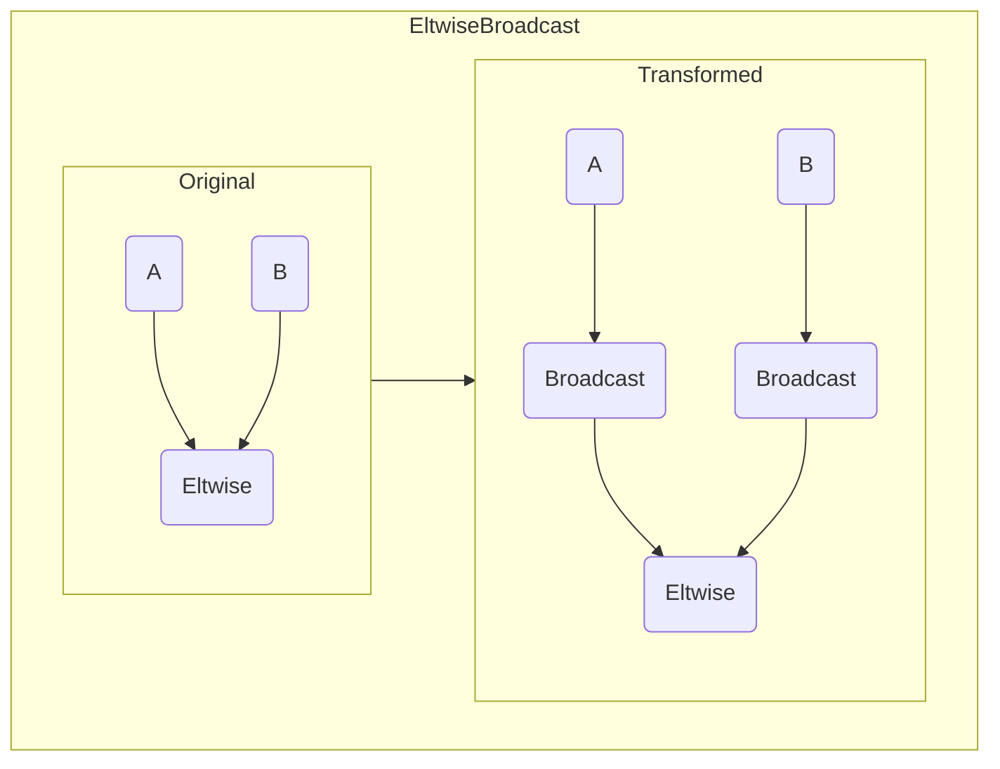
```mermaid
flowchart LR
  subgraph EltwiseBroadcast
    direction LR
    subgraph Original
        f0(A) -->f1(Eltwise)
        f2(B) --> f1
    end
    subgraph Transformed
        f3(A) --> f4(Broadcast)
        f4 --> f5(Eltwise)
        f6(B) --> f7(Broadcast)
        f7 --> f5
    end
  end
  Original --> Transformed
```

### ZeroAdd
> Shuffle: False

If input to eltwise add is a dvtensor with all 0s, then remove it

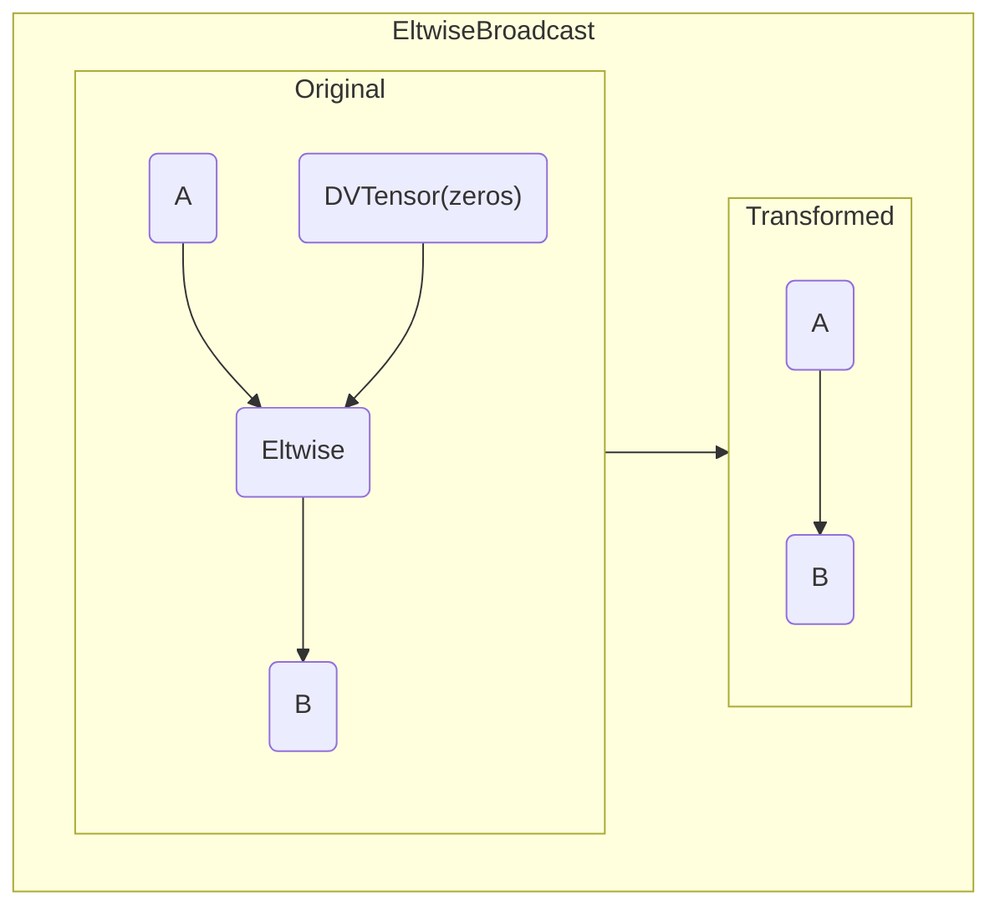
```mermaid
flowchart LR
  subgraph EltwiseBroadcast
    direction LR
    subgraph Original
        f0(A) -->f1(Eltwise)
        f2("DVTensor(zeros)") --> f1
        f1 --> f3(B)
    end
    subgraph Transformed
        f4(A) --> f5(B)
    end
  end
  Original --> Transformed
```

### BroadcastEltwisePatching
> Shuffle: False

If broadcast is already present in graph and the eltwise layer is not in generic cp list,
fuse broadcast for better perf.
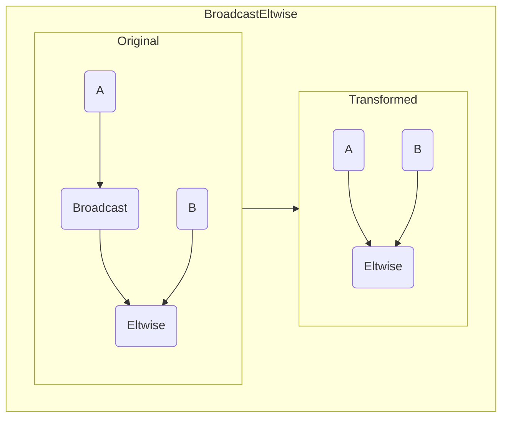
```mermaid
flowchart LR
  subgraph BroadcastEltwise
    direction LR
    subgraph Original
        f0(A) -->f1(Broadcast)
        f1 --> f2(Eltwise)
        f3(B) --> f2

    end
    subgraph Transformed
        f4(A) --> f5(Eltwise)
        f6(B) --> f5
    end
  end
  Original --> Transformed
```

### EltwiseConstantPatching
> Shuffle: False

# flatten-py
> Shuffle: False

Flatten -> Reshape

# h_to_w-py
> Shuffle: False 
### Reduction
### L1Norm
### LayerNorm
### GroupNorm
### SoftMax
### BatchNorm
### HtoWforLayerNorm & HtoWforLayernNorm

# input-py
> Shuffle: False

# layer_fusion-py
> Shuffle: True

# linear_upsample-py
> Shuffle: False

# pad_fusion-py
> Shuffle: False

# permute-py
> Shuffle: False
### FusePermute
### PermuteNNP
### RemoveRedundantPermute
### PermuteLarge
### PermuteToReshape

# pooling-py
> Shuffle: False
### ReductionPatching

# reduce-py
> Shuffle: False

# remove_no_op_layers-py
> Shuffle: False

### AvgPool
### Pool 
### Pad
### Crop
### Reshape

# remove_redundant_layers-py
> ??? 

# squash_consecutive_layer-py
> Shuffle: False 
### Pads
### Crops
### Reshape

# standardize_padding-py
> Shuffle: False
### Padding
### KernelShape
### Strides

# swish-py
> Shuffle: False (make sure last layer has last Swish Name)

# upsample-py
> Shuffle: False

# Others
## aten-py
## batchloop-py
## cast-py
## dynamic_input-py
## group-py
## ibn_pattern_mather-py
## identity-py
## lut-py
## reduce-py  - reduce len of name